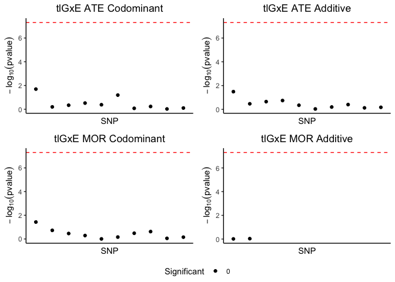
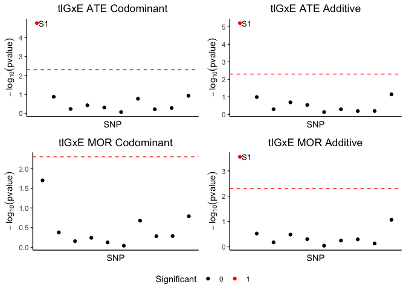
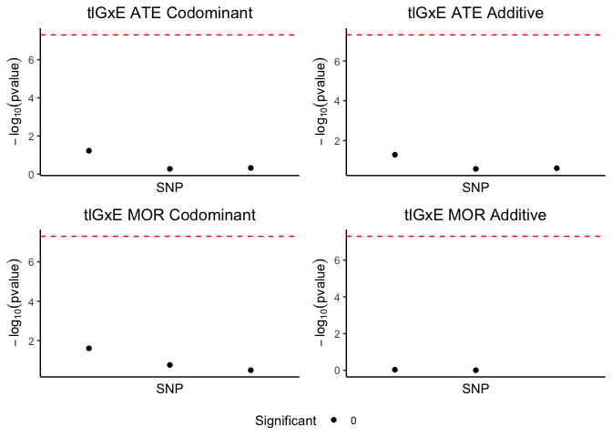

<!-- README.md is generated from README.Rmd. Please edit that file -->

# tlGxE: Targeted Learning for Gene Environment Interaction Studies

<!-- badges: start -->
<!-- badges: end -->

# Overview

`tlGxE` estimates Gene Environment Interaction (GxE) effects using
targeted learning for binary exposures and either binary or continuous
outcomes. More specifically, `tlGxE` assesses causal effect modification
of an exposure by SNP genotype (0, 1, or 2 of a minor allele) in both
average treatment effect (ATE) and marginal odds ratio (MOR) scales
using codominant and additive (linear contrast) testing procedures. As
the method utilizes targeted learning, `tlGxE` accommodates the use of
data adaptive and flexible machine learning methods in the estimation of
exposure and outcome mechanisms, allowing for less biased estimation.
Use of ensembles of such flexible models, referred to as *SuperLearning*
in the targeted learning literature, is performed by default in the
global propensity model of `tlGxE` and can optionally be performed in
the iterated outcome models. Below, we illustrate several examples using
`tlGxE` and hope that you find use for the method in your analyses!

## Installation

You can install the development version of tlGxE from
[GitHub](https://github.com/) with:

``` r
#install.packages("devtools")
devtools::install_github("Daniel-Rud/tlGxE")
#> Using github PAT from envvar GITHUB_PAT. Use `gitcreds::gitcreds_set()` and unset GITHUB_PAT in .Renviron (or elsewhere) if you want to use the more secure git credential store instead.
#> Downloading GitHub repo Daniel-Rud/tlGxE@HEAD
#> clock (0.7.2 -> 0.7.3) [CRAN]
#> Installing 1 packages: clock
#> 
#> The downloaded binary packages are in
#>  /var/folders/b4/9kg7p6cj729_pzc5dggk_9jm0000gn/T//RtmpKt2l0H/downloaded_packages
#> ── R CMD build ─────────────────────────────────────────────────────────────────
#>      checking for file ‘/private/var/folders/b4/9kg7p6cj729_pzc5dggk_9jm0000gn/T/RtmpKt2l0H/remotes16c63498cbccc/Daniel-Rud-tlgxe-17ad63a/DESCRIPTION’ ...  ✔  checking for file ‘/private/var/folders/b4/9kg7p6cj729_pzc5dggk_9jm0000gn/T/RtmpKt2l0H/remotes16c63498cbccc/Daniel-Rud-tlgxe-17ad63a/DESCRIPTION’
#>   ─  preparing ‘tlGxE’:
#>      checking DESCRIPTION meta-information ...  ✔  checking DESCRIPTION meta-information
#>   ─  checking for LF line-endings in source and make files and shell scripts
#>   ─  checking for empty or unneeded directories
#>    Omitted ‘LazyData’ from DESCRIPTION
#>   ─  building ‘tlGxE_0.1.0.tar.gz’
#>      
#> 
```

# Example

`tlGxE` estimates causal effect modification, which is usually measures
using marginal quantities such as the ATE and the MOR. As it is well
known that marginal and conditional odds ratios may not coincide due to
the non-collapsibility of the odds ratio, we perform our simulations
using a continuous outcome without any exposure confounder interactions.
This way, our data generation process is more friendly to analyze.

## Data Generation

For our purpose, we will generate a set of 10 SNPs all having minor
allele frequency of MAF = 0.3. In addition, we will specify an exposure
variable `E` that depends on three confounders `age`, `sex`, `cohort`
such that the overall propensity of exposure is close to 0.5. Finally,
we can specify an outcome model that includes the interaction between
the first SNP and `A`, as well as adjusting for the other confounders.

``` r
if (!require(mvtnorm)) install.packages("mvtnorm", dependencies = TRUE) # for mvtnorm
#> Loading required package: mvtnorm
if (!require(magrittr)) install.packages("magrittr", dependencies = TRUE); library(magrittr) # for %>%
#> Loading required package: magrittr

set.seed(1) # for reproducibility
#################################################################
# Generate SNP Data 
#################################################################
n = 2000
n_snp = 10
SNP_MAF = rep(0.3, n_snp)
snp_data = mvtnorm::rmvnorm(n = n, mean = rep(0,n_snp))
# discretize SNP data according to MAF
G = sapply(1:n_snp,
                  FUN = function(x)
                  {
                    
                    col = snp_data[,x]
                    # SNPs discretized according to binomial probabilities from MAF
                    quantiles = quantile(col, probs = c((1-SNP_MAF[x])^2,
                                                        (1-SNP_MAF[x])^2 + 2*(SNP_MAF[x])*(1-SNP_MAF[x]))) # p^2 + 2pq
                    SNP = col
                    SNP[which(col <= quantiles[1])] = 0
                    SNP[which(col <= quantiles[2] & col > quantiles[1])] = 1
                    SNP[which(col > quantiles[2])] = 2
                    return(SNP)
                  })
colnames(G) = paste0("S", 1:10)

#################################################################
# Generate Confounder Data 
#################################################################
age = rnorm(n, mean = 45, sd = 5)
sex = sample(c(0,1), size = n, replace = T)
cohort = sample(1:4, size = n, prob = c(.3, .1, .4,.2), replace = T) %>% factor 

#################################################################
# Generate Exposure Model 
#################################################################
B_age = 0.025; B_sex = .5
B_cohort_2 = -.2; B_cohort_3 = .15; B_cohort_4 = -.2
exposure_int = -1.5

logit_pi_i =  exposure_int + 
  B_age * age + B_sex * sex + 
  B_cohort_2 * I(cohort == 2) + B_cohort_3 * I(cohort == 3) + B_cohort_4 * I(cohort == 4) 

E = rbinom(n, 1, plogis(logit_pi_i))
mean(E) 
#> [1] 0.465

#################################################################
# Generate Outcome Model 
#################################################################
B_E = 1.5; B_G = c(rep(.25, 5), rep(-.25, 5)); B_GE = 2.5
B_age = 0.075; B_sex = -1.2
B_cohort_2 = 1.3; B_cohort_3 = 2.4; B_cohort_4 = -1.8
outcome_int = -5.5
resid_sd = 16

Y = outcome_int + 
  G %*% B_G  + B_E * E  + B_GE * E * G[,1] + 
  B_age * age + B_sex * sex + 
  B_cohort_2 * I(cohort == 2) + B_cohort_3 * I(cohort == 3) + B_cohort_4 * I(cohort == 4) + 
  rnorm(n, resid_sd)
```

## Using tlGxE – First Example

To run `tlGxE`, we will need to specify the outcome `Y`, the exposure
variable `E`, and the SNP matrix (or dataframe) `G`. In addition, we can
supply a data frame or matrix of confounders `W` that are in a numeric
coding. We will first demonstrate running `tlGxE` without SuperLearning
in the outcome model and will use a `glmnet` outcome model. `tlGxE` uses
SuperLearning in the global propensity model, by default.

Notice that, because our cohort variable is a factor variable, we will
need to use the `model.matrix` function to create a confounder matrix
that creates the dummy variables for factor variables.

``` r
library(tlGxE)
#> Loading required package: SuperLearner
#> Loading required package: nnls
#> Loading required package: gam
#> Loading required package: splines
#> Loading required package: foreach
#> Loaded gam 1.22-5
#> Super Learner
#> Version: 2.0-29
#> Package created on 2024-02-06
W = model.matrix(~ age + sex + cohort, data = data.frame(age, sex, cohort))[,-1]

tlGxE_1 = tlGxE(Y = Y, E = E, G = G, 
                W = W, 
                family = "gaussian", 
                TMLE_args_list = list(outcome_method = c("glmnet"),
                                      nfolds_cv_Q_init = 10,
                                      nfolds_cv_glmnet_outcome = 5, 
                                      alpha_outcome = 0.5), 
                propensity_SL.library = c("SL.glmnet", "SL.rpart", "SL.bartMachine"),
                propensity_SL.cvControl = list(V = 10)
)
#> Fitting Propensity model using Super Learner...
#> Loading required namespace: glmnet
#> Iterating tlGxE over SNPs in `G`...
```

A few notes on the parameters included:

- `TMLE_args_list`:

  - `outcome_method`: Can supply one of the following: `"glmnet"`,
    `"glmnet_int"`, `"gesso"`, `"SL"` for the outcome model
    specification. The first three models are penalized regression
    models, where `"glmnet"` corresponds to a main effect glmnet model,
    `"glmnet_int"` a non-hierarchical interaction model that includes
    all main effects for adjusting variables, along with interactions
    between exposure `E` and all adjusting covariates, and `"gesso"`
    computes the hierarchical lasso GxE model described in Zemlianskaia
    et al 2022. “SL” corresponds to using SuperLearning, where the
    SuperLearner can be configured through the `outcome_SL.library` and
    `outcome_SL.cvControl` options.
  - `nfolds_cv_Q_init`: Controls the number of cross validation folds
    for the CV-TMLE in the initial outcome model.
  - `nfolds_cv_glmnet_outcome`: Controls the number of cross validation
    folds for fitting the outcome model *IF* the outcome model is not
    `SL`. If the outcome model is `SL`, then the cross validation folds
    can be set in the `outcome_SL.cvControl` parameter.  
  - `alpha_outcome`: Controls the `alpha` parameter in `glmnet`, which
    corresponds to the mixing between the ridge and lasso penalties.

- `propensity_SL.library`: Defines the learners to use in the
  SuperLearner. Can see available learners using
  `SuperLearner::listWrappers()`

- `propensity_SL.cvControl`: Options to control the cross validation for
  the propensity model (see `tlGxE` documentation).

Lets look at the first column of the matrix returned from the `tlGxE`
call.

``` r
tlGxE_1[,1,drop = F] %>% round(8)
#>                                      S1
#> ATE_G0                       1.56250225
#> ATE_G1                       3.92286200
#> ATE_G2                       6.67566182
#> var_ATE_G0                   0.00458034
#> var_ATE_G1                   0.00513722
#> var_ATE_G2                   0.02918072
#> MOR_G0                       0.99209261
#> MOR_G1                       0.98373703
#> MOR_G2                       0.97643591
#> var_MOR_G0                   0.00000012
#> var_MOR_G1                   0.00000011
#> var_MOR_G2                   0.00000063
#> ATE_codominant_F_statistic 539.15685754
#> ATE_codominant_pvalue        0.00000000
#> MOR_codominant_F_statistic 241.57261758
#> MOR_codominant_pvalue        0.00000000
#> ATE_additive_baseline_est    1.52940499
#> ATE_additive_lin_est         2.46769944
#> ATE_additive_pvalue          0.00000000
#> MOR_additive_baseline_est    0.99199360
#> MOR_additive_mult_est        0.99186102
#> MOR_additive_pvalue          0.00000000
```

The model output contains (in the rows):

- {`ATE_G0`, `ATE_G1`, `ATE_G2`}: The estimated ATEs within subgroups of
  individuals who have 0, 1, or 2 of the minor allele for the analyzed
  SNP.
- {`var_ATE_G0`, `var_ATE_G1`, `var_ATE_G2`}: Variance estimates of the
  ATEs within subgroups of individuals who have 0, 1, or 2 of the minor
  allele for the analyzed SNP.
- {`MOR_G0`, `MOR_G1`, `MOR_G2`}: The estimated MOR within subgroups of
  individuals who have 0, 1, or 2 of the minor allele for the analyzed
  SNP.
- {`MOR_G0`, `MOR_G1`, `MOR_G2`}: The estimated MOR within subgroups of
  individuals who have 0, 1, or 2 of the minor allele for the analyzed
  SNP.
- {`var_MOR_G0`, `var_MOR_G1`, `var_MOR_G2`}: Variance estimates of the
  MORs within subgroups of individuals who have 0, 1, or 2 of the minor
  allele for the analyzed SNP.
- {`ATE_codominant_F_statistic`, `ATE_codominant_pvalue`}: The
  F-statistic and p-value for codominant causal effect modification
  testing of the ATE.
- {`MOR_codominant_F_statistic`, `MOR_codominant_pvalue`}: The
  F-statistic and p-value for codominant causal effect modification
  testing of the MOR
- {`ATE_additive_baseline_est`, `ATE_additive_lin_est`,
  `ATE_additive_pvalue`}: The estimated baseline ATE for the `SNP = 0`
  subgroup, along with the estimated additive effect of a one unit minor
  allele increase on ATE; p-value testing for significance of the
  additive ATE effect. The null hypothesis for the test is that
  $H_0: \text{ATE\_additive\_lin\_est} = 0$.
- {`MOR_additive_baseline_est`, `MOR_additive_mult_est`,
  `MOR_additive_pvalue`}: The baseline and estimated multiplicative MOR
  for the additive model, along with the p-value testing for
  significance of the additive MOR effect. The null hypothesis for the
  test is that $H_0: \text{MOR\_additive\_mult\_est} = 1$.

To plot the results of four causal effect modification tests using a
manhattan-like plot, we can use the `plot` function

``` r
plot(tlGxE_1, alpha = 5*10^-8)
```



## A more involved tlGxE model – Parameter tuning

`tlGxE` offers quite a few options in terms of customizing the
estimation of the global propensity model and the outcome models. In
this example, we will use a more comprehensive list of parameters to
estimate a `tlGxE` model and describe the parameter configuration. In
this model, we will specify both a super learner for the global
propensity and outcome models. First, to see what models are available
in the superlearner, we can use the following `listWrappers()` function
in the SuperLearner package

``` r
SuperLearner::listWrappers()
#> All prediction algorithm wrappers in SuperLearner:
#>  [1] "SL.bartMachine"      "SL.bayesglm"         "SL.biglasso"        
#>  [4] "SL.caret"            "SL.caret.rpart"      "SL.cforest"         
#>  [7] "SL.earth"            "SL.gam"              "SL.gbm"             
#> [10] "SL.glm"              "SL.glm.interaction"  "SL.glmnet"          
#> [13] "SL.ipredbagg"        "SL.kernelKnn"        "SL.knn"             
#> [16] "SL.ksvm"             "SL.lda"              "SL.leekasso"        
#> [19] "SL.lm"               "SL.loess"            "SL.logreg"          
#> [22] "SL.mean"             "SL.nnet"             "SL.nnls"            
#> [25] "SL.polymars"         "SL.qda"              "SL.randomForest"    
#> [28] "SL.ranger"           "SL.ridge"            "SL.rpart"           
#> [31] "SL.rpartPrune"       "SL.speedglm"         "SL.speedlm"         
#> [34] "SL.step"             "SL.step.forward"     "SL.step.interaction"
#> [37] "SL.stepAIC"          "SL.svm"              "SL.template"        
#> [40] "SL.xgboost"
#> 
#> All screening algorithm wrappers in SuperLearner:
#> [1] "All"
#> [1] "screen.corP"           "screen.corRank"        "screen.glmnet"        
#> [4] "screen.randomForest"   "screen.SIS"            "screen.template"      
#> [7] "screen.ttest"          "write.screen.template"
```

Let us specify our global propensity model to include {`SL.glmnet`,
`SL.rpart`, `SL.bartMachine`, `SL.glm`} and our outcome model to include
{`SL.glmnet`, `SL.gam` }. In addition, we will specify the following
choices:

- `include_G_propensity = T`: We will include all SNPs in G into the
  estimation of the global propensity model (default only considers
  including the confounders in W). One of the considerations whether we
  would like to include `G` in the propensity is that if `G` is high
  dimensional, we will need to use learners that can accommodate `G`’s
  size. If we rely on the *doubly robustness* property of targeted
  maximum likelihood estimation and choose simpler adjustments for
  including `G` in the outcome model, we can specify a more data
  adaptive propensity model that better estimates the exposure mechanism
  as a function of just the confounders in `W`. This is a tradeoff of
  course, and the user is welcome to specify accordingly to their
  desired analysis.
- `include_W_outcome = T`: We will include all confounders in the
  outcome model. This option can be set to false if we only wish to
  include the confounder adjustment in the propensity model, which can
  be done by leveraging the *doubly robustness* property of targeted
  maximum likelihood estimation. The default is set to `TRUE`, since the
  confounder set is generally small in comparison to `G`, which can be
  large. The advantage of including `W` in the outcome model is that we
  will have two chances to correctly specify the confounder-exposure or
  confounder-outcome mechanisms (if either correct, we will have
  unbiased estimation).  
- `SNP_results = 1:3`: We choose to only perform the scan for the first
  3 SNPs. Still, all SNPs in G (aside for the current SNP) are adjusted
  for in the estimation; however, column indices of `G` not included in
  `SNP_results` will not have `tlGxE` iterated over it.

``` r
tlGxE_2 = tlGxE(Y = Y, E = E, G = G, 
                W = W, 
                family = "gaussian", 
                TMLE_args_list = list(outcome_method = c("SL"),
                                      outcome_SL.library = c("SL.glmnet",
                                                             "SL.gam")),
                propensity_SL.library = c("SL.glmnet", "SL.rpart",
                                          "SL.bartMachine", "SL.glm"), 
                include_G_propensity = T,
                include_W_outcome = T, 
                SNP_results = 1:3)
#> Fitting Propensity model using Super Learner...
#> Iterating tlGxE over SNPs in `G`...

plot(tlGxE_2, alpha = 5*10^-8)
```



## Using Custom Formulas for Global Propensity and Outcome Models

If the user has a good understanding of either or both of the exposure
and outcome mechanisms, they can supply the functional relationship
using model formulas. We provide arguments to supply the functional
relationships, that can include standard transformations that can be
accommodated in a `glm` call in R (essentially anything model.matrix can
process). Below, find some notes for the formula specifications:

- `propensity_formula`: In this formula, we can include any columns from
  W or G. **AN IMPORTANT NOTE:** The left hand side of the equation
  should reference the exposure as the name `E` **irregardless** of the
  name of `E`. This is because the `E` vector, even if passed as
  `E = exposure`, is internally referenced using the variable `E`. In
  addition, if we wish to reference elements of `W` and `G`, we must
  ensure that both `W` and `G` have appropriate column names that can be
  referenced. For example, see below how we name the SNPs in `G` as
  S1-S10, and include S10 in the propensity model. Because the
  propensity model, if specifified with `propensity_formula`, is fitted
  using a standard `glm`, one must ensure that there is sufficient
  observations for number of features.

- `outcome_formula`: In this formula, we can include columns from `G`
  and columns from `W` (*IF* `include_W_outcome = T`). If we do want to
  specify an outcome formula, we must be very careful about including
  specific SNPs in the outcome model. This is because we do not want to
  include a SNP as a covariate that we will be iterating `tlGxE` over.
  Therefore, we advise adjusting for SNPs in the general outcome model
  that are **NOT** included for analysis, as determined by the
  `SNP_results` variable. See the example below, where we only perform
  the analysis on SNPs 1-3, and include SNP 10 as an adjustment in the
  outcome model. Again, when referring to elements of `W` and `G` in the
  model formula, we must ensure that both `W` and `G` have appropriate
  column names that can be referenced.

**IMPORTANT NOTE**: when specifying the outcome model, **irregardless**
of the naming of ones outcome and exposure corresponding to `Y` and `E`
respectively, the outcome formula must always have the left hand side as
`Y` and the first term in the right hand side as the exposure `E`. This
is needed due to how `tlGxE` internally references these variables. See
below a specification of the outcome formula.

``` r
tlGxE_3 = tlGxE(Y = Y, E = E, G = G, 
                W = W, 
                family = "gaussian", 
                propensity_formula = E ~ I(log(age)) + sex + cohort2 + cohort3 + cohort4 + S10, 
                outcome_formula = Y ~  E + age + sex + cohort2 + cohort3 + cohort4 + I(S8^2) + S10,
                include_G_propensity = T,
                include_W_outcome = T, 
                SNP_results = 1:3)
#> Iterating tlGxE over SNPs in `G`...

plot(tlGxE_3, alpha = 5*10^-8)
```



There are many tuning parameters in `tlGxE`. Please refer to the
documentation of `tlGxE` to see all the functionalities of the method.
Note that many of the tuning parameters control the different cross
validation schemes for different parts of `tlGxE`. Cross validation
takes place in the SuperLearner of the global propensity model, the
CV-TMLE for the outcome model, and for the estimation of the outcome
model (if SuperLearner is used, another nested level of cross
validation).

## Estimating ATE / MOR under additive assumption

Under the assumption of additivity of effect modification per one minor
allele increase, one can produce estimates for (ATE_0, ATE_1, ATE_2) and
(MOR_0, MOR_1, MOR_2) across the subgroups with 0, 1, and 2 of the minor
allele. We can compute these estimates according to the following for a
single SNP (we do for S1):

- **ATE**: Because we assume additivity of effect modification in the
  original scale, we can compute

``` r
ATEs_under_additivity = c(ATE_0 = tlGxE_1["ATE_additive_baseline_est","S1"], ATE_1 = tlGxE_1["ATE_additive_baseline_est","S1"] + tlGxE_1["ATE_additive_lin_est","S1"], ATE_2 = tlGxE_1["ATE_additive_baseline_est","S1"] + 2*tlGxE_1["ATE_additive_lin_est","S1"])
ATEs_under_additivity %>% round(3)
#> ATE_0 ATE_1 ATE_2 
#> 1.529 3.997 6.465
```

- **MOR**: Because we assume additivity of effect modification in the
  log linear scale, we need to multiply the baseline MOR by the
  estimated effect modification multiplicative factor as shown:

``` r
MORs_under_additivity = c(MOR_0 = tlGxE_1["MOR_additive_baseline_est","S1"], MOR_1 = tlGxE_1["MOR_additive_baseline_est","S1"] * tlGxE_1["MOR_additive_mult_est","S1"], MOR_2 = tlGxE_1["MOR_additive_baseline_est","S1"]*tlGxE_1["MOR_additive_mult_est","S1"]^2)
MORs_under_additivity %>% round(3)
#> MOR_0 MOR_1 MOR_2 
#> 0.992 0.984 0.976
```

Note here that the MOR is not very meaningful for the continuous
outcome, but is arguably the more meaningful measure of average causal
effect for binary outcomes.
